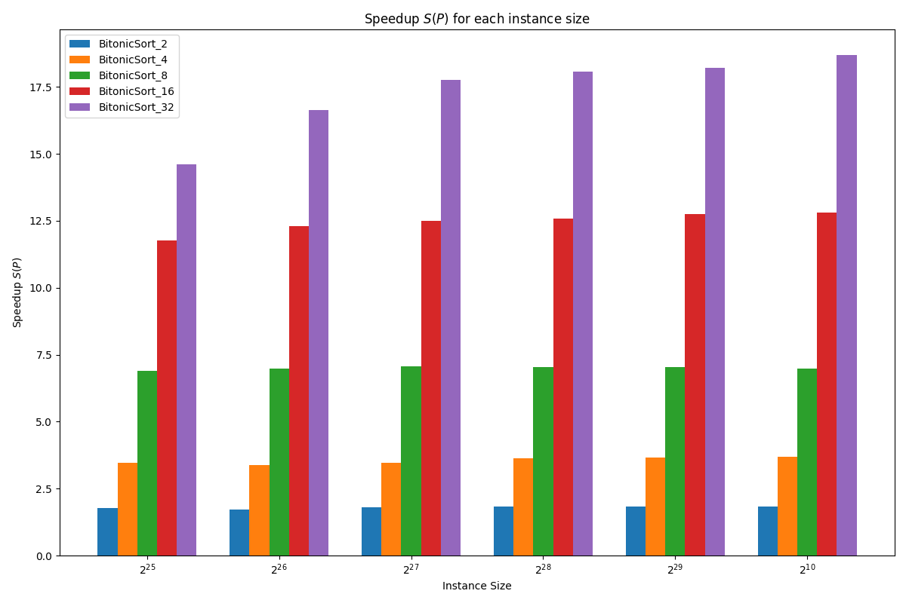
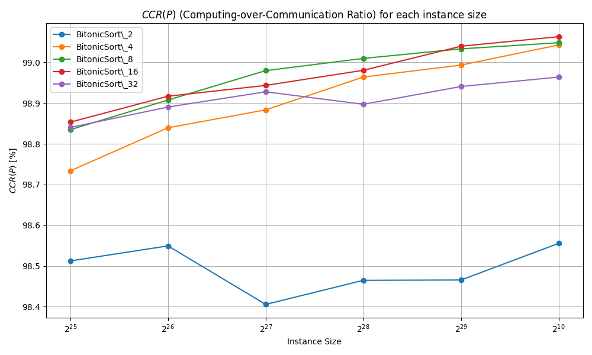

# 🧮 Parallel Sorting with MPI

## Overview

This project implements a parallel sorting algorithm using MPI on a virtual hypercube architecture. We leverage the power of distributed computing to sort large datasets efficiently.

## 🌟 Key Features

- **Merge Sort**: Efficient sequential sorting algorithm
- **Bitonic Sort**: Parallel implementation using hypercube topology
- **MPI**: Utilized for inter-process communication
- **Scalability**: Tested on various dataset sizes and processor counts

## 📊 Performance Highlights

- Linear speedup with increasing processor count
- High Computing-over-Communication Ratio ($CCR > 98\%$)
- Efficient handling of large datasets (up to $2^{30}$ elements)

## 🛠️ Implementation Details

- Sequential Merge Sort implemented in C
- Parallel Bitonic Sort implemented using MPI
- Tested on [CAPRI](https://capri.dei.unipd.it) High-Performance Computing (HPC) system

## 📈 Results


*Speedup* $S(P)$ *vs Number of Processors* $P$


*Computing-over-Communication Ratio* $CRR(P)$

## 🚀 Getting Started

1. Clone the repository
2. Ensure [MPI](https://www.mpi-forum.org) is installed on your system
3. Compile the code:
   ```
   make
   ```
4. Run the sequential algortihm:
   ```
   ./test/test_seq 
   ```
5. Run the parallel algortihm:
   ```
   mpirun -np <num_processors> ./test/test_par
   ```
   
## ⚠️ Important Notice

**NOTICE**: This repository is focused on benchmark analysis. You won't see the actual sorted data here, but rather meaningful metrics and performance measurements. This approach allows us to concentrate on analyzing the efficiency and scalability of our parallel sorting implementation across various scenarios.

## 📚 Further Reading

For a detailed explanation of the algorithm and performance analysis, please refer to the accompanying paper: [Parallel Computing: MPI Parallel Sorting](test/results/Parallel_Computing_MPI_Parallel_Sorting.pdf) by Francesco Biscaccia Carrara.

<!--- 
## 🤝 Contributing

Contributions, issues, and feature requests are welcome! Feel free to check the [issues page](link-to-issues-page).
--->
## 📄 License

This project is licensed under the MIT License - see the [LICENSE](LICENSE) file for details.

[](LICENSE)

---

Made with 💻 and ☕ by Francesco Biscaccia Carrara
