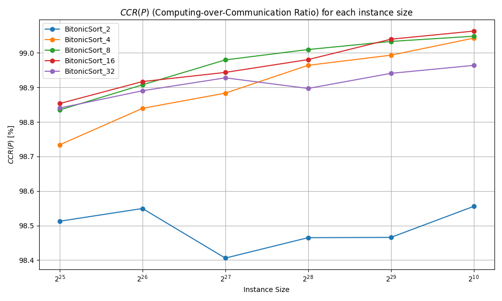

# 🚀 Parallel Sorting with MPI

## Overview

This project implements a parallel sorting algorithm using MPI on a virtual hypercube architecture. We leverage the power of distributed computing to sort large datasets efficiently.

## 🌟 Key Features

- **Merge Sort**: Efficient sequential sorting algorithm
- **Bitonic Sort**: Parallel implementation using hypercube topology
- **MPI**: Utilized for inter-process communication
- **Scalability**: Tested on various dataset sizes and processor counts

## 📊 Performance Highlights

- Linear speedup with increasing processor count
- High Computing-over-Communication Ratio (CCR > 98%)
- Efficient handling of large datasets (up to 2^30 elements)

## 🛠️ Implementation Details

- Sequential Merge Sort implemented in C
- Parallel Bitonic Sort implemented using MPI
- Tested on CAPRI High-Performance Computing (HPC) system

## 📈 Results


*Speedup vs Number of Processors*


*Computing-over-Communication Ratio*

## 🚀 Getting Started

1. Clone the repository
2. Ensure MPI is installed on your system
3. Compile the code:
   ```
   make
   ```
4. Run the sequential algortihm:
   ```
   test/test_seq 
   ```
5. Run the parallel algortihm:
   ```
   mpirun -np <num_processors> test/test_par
   ```

## 📚 Further Reading

For a detailed explanation of the algorithm and performance analysis, please refer to the accompanying paper: "Parallel Computing: MPI Parallel Sorting" by Francesco Biscaccia Carrara.

## 🤝 Contributing

Contributions, issues, and feature requests are welcome! Feel free to check the [issues page](link-to-issues-page).

## 📄 License

This project is licensed under the MIT License - see the [LICENSE](LICENSE) file for details.

---

Made with 💻 and ☕ by Francesco Biscaccia Carrara
